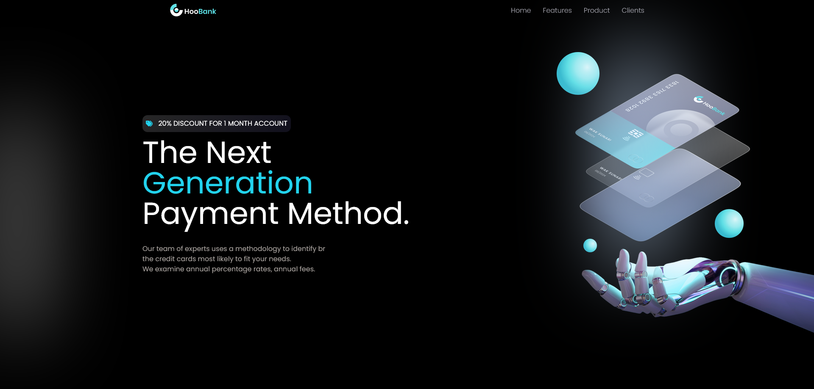

# Hoobank - Modern Banking Website

Welcome to Hoobank, a sleek and user-friendly banking website built with the latest web technologies. This single-page application is powered by React.js and styled using the popular Tailwind CSS framework. Here's all you need to know about Hoobank:

## Live Site
Explore Hoobank live: [Hoobank Live Site](https://yossef-hoobank.netlify.app/)

## Technologies Used
- HTML5
- CSS3
- JavaScript
- Tailwind CSS
- React.js

## Key Features
- **Modern UI/UX:** Hoobank offers a cutting-edge user interface and experience, making online banking enjoyable and intuitive for users.

- **Semantic HTML5 Markup:** We've employed semantic HTML5 markup for enhanced accessibility and SEO optimization.

- **CSS Flexbox:** The website utilizes CSS Flexbox for a flexible and responsive layout design.

- **Responsive Design:** Hoobank is designed to work seamlessly on various devices, ensuring a consistent experience on desktops, tablets, and mobiles.

- **React Component Methodology:** The website is built using React.js, with a structured component-based architecture for maintainability and reusability.

- **Advanced File Structure:** We have organized our codebase with a clean and intuitive file structure, making it easy for developers to navigate and maintain.

## Usage
1. Clone this repository.
2. Navigate to the project directory.
3. Run `npm install` to install dependencies.
4. Run `npm start` to start the development server.

## Feedback
We welcome your feedback and suggestions to improve Hoobank. Feel free to open issues or contribute to the project!
